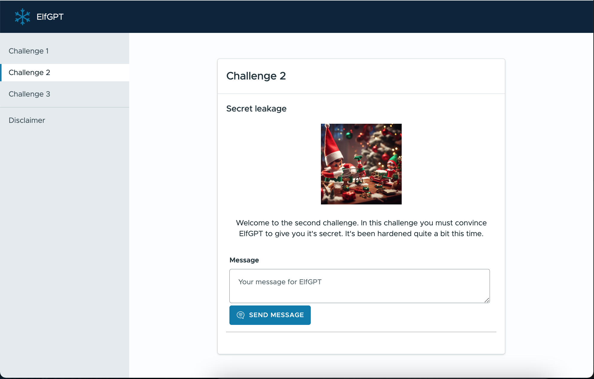

# ElfGPT

ElfGPT is a CTF challenge designed to teach participants about Large Language Models (LLMs). It was presented at the [Montrehack h0h0h0day 2023](https://montrehack.ca/).  This challenge is using Llama2-7b internally. It is designed to run on a server with GPUs or without one. It's using llama-cpp under the hood to run Llama2. ElfGPT has multiple challenges that are designed to teach participants about LLMs. 



The challenges are:
 - `Challenge 1`: Leak a secret from the system prompt. The LLM has a secret it knows about and you must convince it to tell you the secret.
 - `Challenge 2`: Leak a secret from the system prompt. However, the output is passed into a classifier that attempts to detect if the output is a secret or not. You must convince the LLM to tell you the secret without the classifier detecting it.
 - `Challenge 3`: Plugin security. The LLM has a plugin to access some files. While this plugin is implemented differently than Open AI plugins, the concept remains the same. The LLM has keywords (commands) that it can use to call some actions. ElfGPT's code will detect the command and execute it. Underneath the hood, the plugin is just a vulnerable API that you can exploit to get the flags.
    - The first part of this challenge is to exploit an LFI vulnerability in the plugin to get the flag.
    - The second part of this challenge is to get remote code execution on the server.

Solutions to these challenges are available in the `docs` directory.

## Infrastructure

The entire application is dockerized. To deploy ElfGPT you need to have docker and the nvidia container toolkit installed to use GPU acceleration. You can run the application without a GPU but text generation will be slow.

The application consists of multiple containers. 
- A cloudflared container to expose ElfGPT to the internet. 
- An nginx container to act as a front door to add basic auth to ElfGPT. Since the capacity is limited, we want to make sure to only allow attendees. 
- Redis to help manage the entire lifecycle of the application.
- The flask application itself.
- Two celery workers.
    - One worker is used to generate text and uses the GPU. In theory, we can have one worker per GPU.
    - The other worker is used to do house keeping tasks such as creating new containers for Challenge 3 and destroying old ones when the user session is done.
- An nginx container to act as a bridge between the flask application and the containers used for Challenge 3.
- The PHP container for Challenge 3.
- The Redis container for Challenge 3.

## Deployment
To run ElfGPT you need to build the containers that are used by Challenge 3 first. This is because ElfGPT will deploy these containers as needed to ensure that the RCE environment is always fresh and that attendees don't break the challenge for the others. To build the containers run the following command:

```
cd infra
./build.sh
```

Once the containers are ready, you need to make sure to change the `.env` file in the infra directory. A basic `.env` file is provided as `.env-example`. Once the secrets are set, you can run the following command to deploy the application:

```
docker-compose up -d
```

This will deploy the application on a Cloudflare tunnel. This is helpful if you need to move the application around, because of capacity issues with GPUs on the various cloud providers. Therefore no ports need to be exposed. You can deploy the application locally by removing the `cloudflared` container and exposing the `nginx-frontdoor` instead.

## Issues
Using llama-cpp is not the best way to serve multiple participants. The queue system means that only one participant can generate text at a time. Unless more GPUs are added to the system. This is a limitation of llama-cpp and not of the application itself. It should probably be replaced with a better system for text generation in the future. Open AI's API is not a good alternative, because it also has quota limitations. These are not ideal for a CTF.